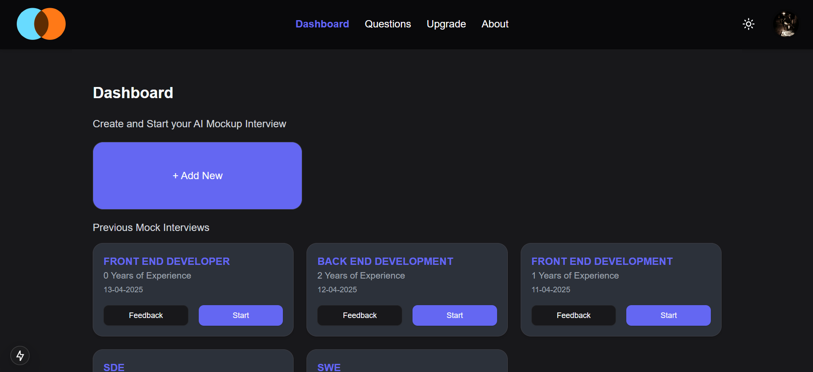
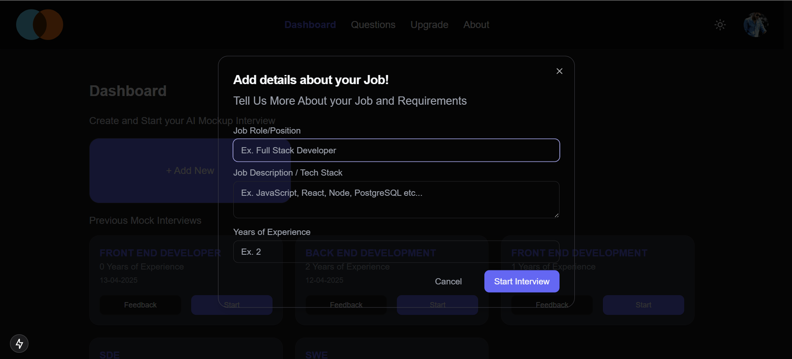
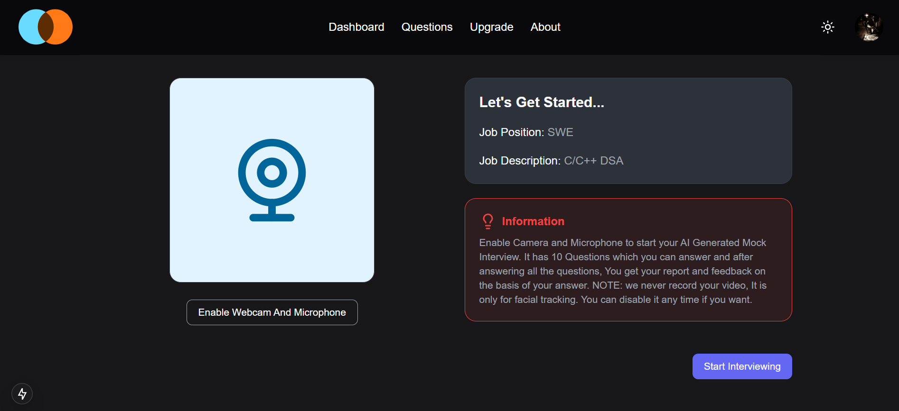
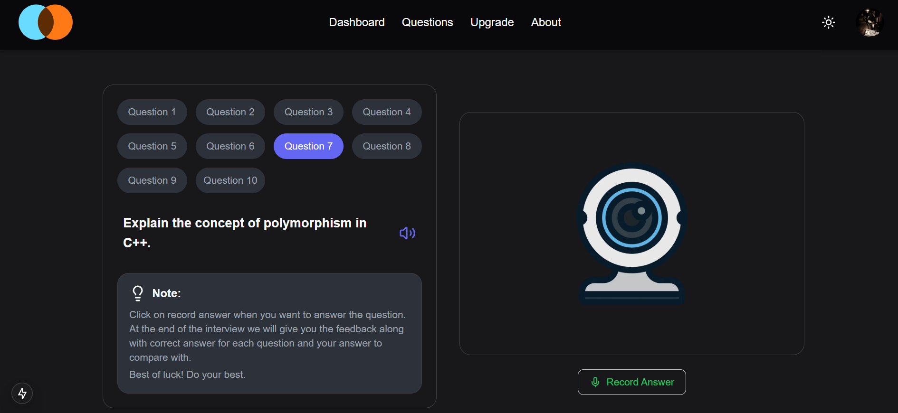
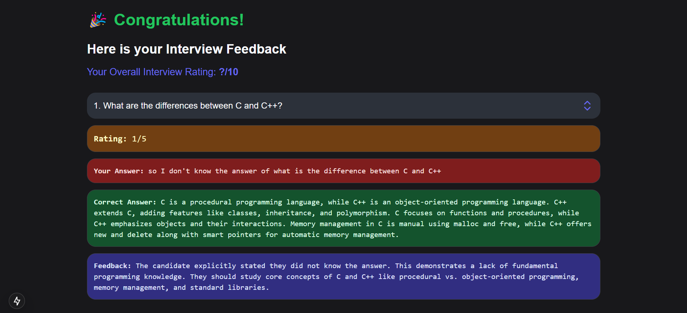

# MockMate

Live Demo: https://mock-mate-plum.vercel.app

MockMate is an AI-powered mock interview platform that helps job seekers practice in realistic, role-specific scenarios. The web app combines AI-generated questions, speech recognition, and structured feedback to help you iterate quickly and build interview confidence.

## Table of Contents
- [Overview](#overview)
- [Features](#features)
- [Tech Stack](#tech-stack)
- [Project Structure](#project-structure)
- [Getting Started](#getting-started)
- [Available Scripts](#available-scripts)
- [Environment Variables](#environment-variables)
- [Screenshots](#screenshots)
- [Contributing](#contributing)
- [License](#license)

## Overview
MockMate guides you through end-to-end mock interviews: define the role, answer AI-generated questions by voice or text, and review targeted feedback to improve your responses. The experience mimics real interviews while remaining accessible in the browser.

## Features
- AI-generated interview questions tailored by role and description
- Voice input with transcription and optional webcam practice mode
- Real-time scoring and actionable suggestions after each answer
- Light and dark themes with responsive, accessible UI components
- Persistent interview history powered by Neon Postgres and Drizzle ORM
- Authentication backed by Clerk to keep interview data private

## Tech Stack
| Technology | Purpose |
| --- | --- |
| Next.js 15 & React 19 | Application framework and UI layer |
| Tailwind CSS & shadcn/ui | Styling and component primitives |
| Google Gemini API | Question generation and feedback |
| Drizzle ORM + Neon Postgres | Database access and storage |
| Clerk | Authentication and session management |
| react-webcam & react-hook-speech-to-text | Voice and video capture |
| next-themes | Theme management |

## Project Structure
```text
Mock-Mate/
  |-- ai-interview/
    |-- app/
    |   |-- (auth)/             # Clerk sign-in and sign-up routes
    |   |-- dashboard/          # Interview management and practice flows
    |   |-- globals.css
    |   |-- layout.jsx
    |   `-- page.jsx
    |-- components/             # Reusable UI components (incl. shadcn/ui)
    |   `-- ui/
    |-- lib/                    # Shared helpers (e.g., theme providers)
    |-- public/                 # Static assets
    |-- utils/                  # Gemini API and database clients
    |-- drizzle.config.js
    |-- middleware.js
    |-- next.config.mjs
    |-- tailwind.config.mjs
    `-- package.json
```

## Getting Started
### Prerequisites
- Node.js 18 or later
- npm 9 or later
- Access credentials for Google Gemini, Clerk, and Neon Postgres

### Installation
```bash
git clone https://github.com/rahulchy960/Mock-Mate.git
cd Mock-Mate/ai-interview
npm install
```

### Local Development
```bash
npm run dev
```
The development server defaults to http://localhost:3000.

## Available Scripts
- `npm run dev` - Start the Next.js development server.
- `npm run build` - Create an optimized production build.
- `npm run start` - Serve the production build locally.
- `npm run lint` - Lint the project with Next.js ESLint configuration.
- `npm run db:push` - Apply Drizzle migrations to the configured database.
- `npm run db:studio` - Launch the Drizzle Studio dashboard.

## Environment Variables
Create a `.env.local` file in `ai-interview/` and provide the required keys:

| Variable | Description |
| --- | --- |
| `NEXT_PUBLIC_GEMINI_API_KEY` | Google Gemini API key used for question generation. |
| `NEXT_PUBLIC_DRIZZLE_DB_URL` | Neon Postgres connection string for Drizzle ORM. |
| `NEXT_PUBLIC_INFORMATION` | Informational banner text shown during interviews. |
| `NEXT_PUBLIC_QUESTION_NOTE` | Helper text displayed alongside generated questions. |
| `NEXT_PUBLIC_CLERK_PUBLISHABLE_KEY` | Clerk publishable key for the frontend SDK. |
| `CLERK_SECRET_KEY` | Clerk secret key for server-side authentication. |

Keep secret values out of version control.

## Screenshots






## Contributing
Pull requests are welcome! Please open an issue first to discuss major changes and ensure secrets are never committed.

## License
This project is licensed under the [Apache License 2.0](LICENSE).
